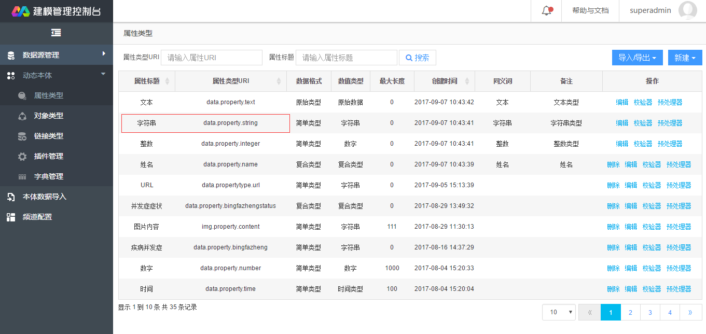

## 背景
大数据分析平台非结构化文件导入任务过程，需要在“文档预处理”和“实体提取插件”分别选择相应的插件。这些插件是在动态本体-插件管理模块统一管理的。该文档是对插件开发流程的简要说明。

## 开发过程
### 1. 搭建工程
建立普通java工程即可。这里开发测试使用Maven构建工程。

### 2. 添加依赖
需要引入插件API，该API依赖位于公司Maven私服中，需要在pom.xml中加入公司私服的依赖，如下：
```xml
<repositories>
    <repository>
        <id>central</id>
        <name>Central</name>
        <url>http://10.110.13.14:8081/nexus/content/groups/public/</url>
        <releases>
            <enabled>true</enabled>
        </releases>
        <snapshots>
            <enabled>true</enabled>
        </snapshots>
    </repository>

    <repository>
        <id>nexus-nlp</id>
        <name>Plugin API</name>
        <url>http://10.110.13.14:8081/nexus/content/groups/public/</url>
        <releases>
            <enabled>true</enabled>
        </releases>
        <snapshots>
            <enabled>true</enabled>
        </snapshots>
    </repository>
</repositories>
```
对插件API的依赖，需要在pom.xml文件中加入以下内容：
```xml
<dependency>
    <groupId>com.inspur.analysis</groupId>
    <artifactId>analysis-tool-plugin</artifactId>
    <version>1.0-SNAPSHOT</version>
</dependency>
```

### 3. 实现接口
开发插件，主要实现插件API中的接口。目前插件API中提供了两个接口com.inspur.analysis.tool.plugin.UnDataClean和com.inspur.analysis.tool.plugin.NlpProcessor，分别负责非结构化数据清洗和自然语言处理。

- UnDataClean接口
该接口包含的方法为`UnData clean(UnData data);`，完成非结构化数据的预处理，如去除html文件中的标签等。

- NlpProcessor接口
该接口包含的方法为`<S extends UnObject> S process(UnData data);`，完成非结构化数据的处理，如提取关键词、摘要等属性信息。需要注意的是，对于返回的UnObject或者其子类，要在本体模型中查询以下信息：

1）对象类型URI
对象类型URI可在建模控制台“动态本体/对象类型”显示的对象模型树中找到，如下图所示：


从图上可看出对象类型URI为data.object.document.test.plugin.a，则需要在实现方法的返回对象中设置该对象URI：
```java
UnObject unObject = new UnObject("data.object.document.test.plugin.a");
```  

2）对象属性类型URI
当前插件主要功能之一即提取文档对象的属性信息，那么不可避免地要涉及属性类型。
接口的实现方法中，需要查询属性标题和属性类型URI。属性标题在上述步骤 1）中已经查询到，如title/abstract等；属性类型URI在需要在“动态本体/属性类型”菜单中查找，如下图所示：


如属性title/abstract对于的属性类型为“字符串”，则对于的属性类型URI为“data.property.string”，在对象属性中进行设置：
```java
Property name = new Property("data.property.string", "title","data.object.document.test.plugin.a");
// NLP其他处理
unObject.setPropertyList(Arrays.asList(new Property[]{name}));//可设置多个对象属性
```

> Note:
以上两个接口可以在同一个插件中实现，也可以在不同的插件中实现。为了简化开发过程，本文档实践过程中选择在同一个插件中实现上述两个接口。

### 4. 构建插件
使用maven构建插件，只需要到插件项目的根目录下执行`mvn clean package`即可。开在项目下的\target目录找到构建完成的插件。如analysis-tool-plugin-dev-test.jar。
完成插件构建后，在“动态本体/插件管理”下新增插件，即可在非结构文档导入使用这些插件了。

## 一个示例
[GitHub](https://github.com/myitroad/analysis-tool-plugin-dev)中演示了一个插件开发示例项目。该项目基于HanLP完成了文档摘要、文档关键词等信息的提取。该插件对应的动态本体类型为“测试插件文档A”

对应的导入任务完成后，可在智能搜索页面可搜索到该文档对象，如下图所示：


 
## 相关资料
【1】GitHub插件开发https://github.com/myitroad/analysis-tool-plugin-dev


Camel Java Router Project
=========================

To build this project use

    mvn install

To run this project from within Maven use

    mvn exec:java

For more help see the Apache Camel documentation

    http://camel.apache.org/

